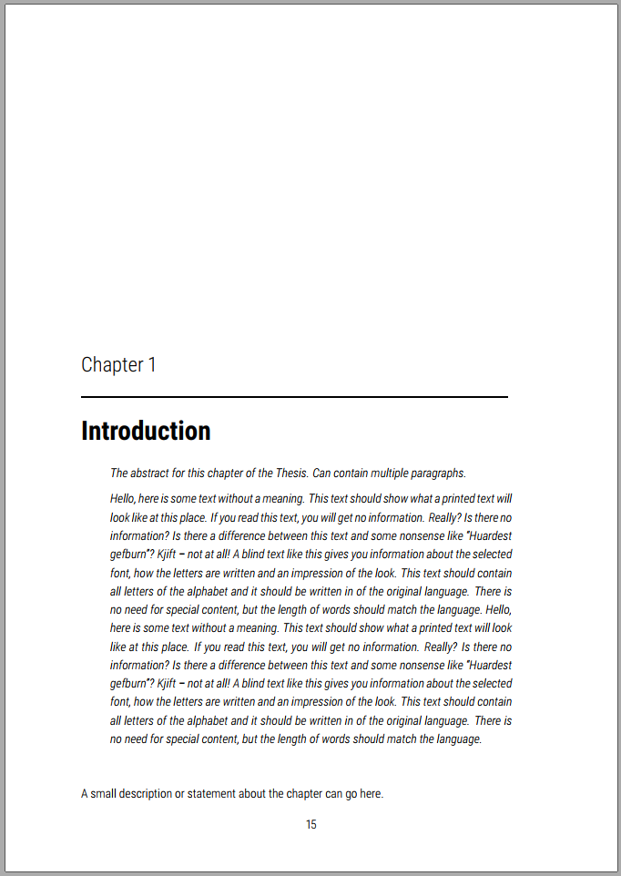
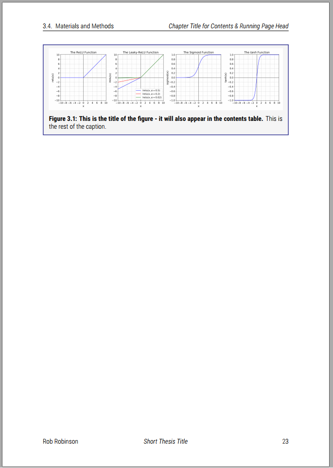
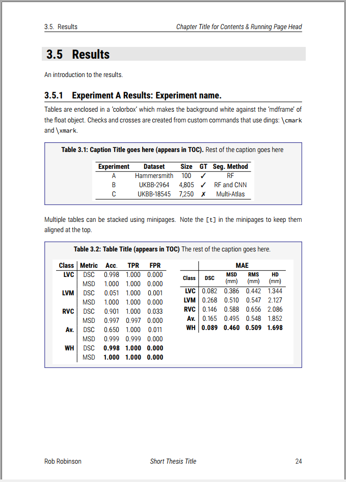
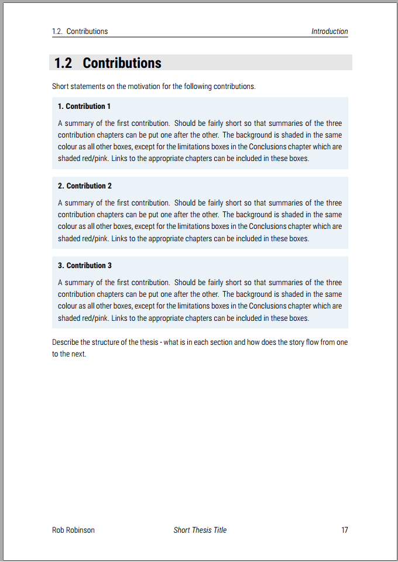
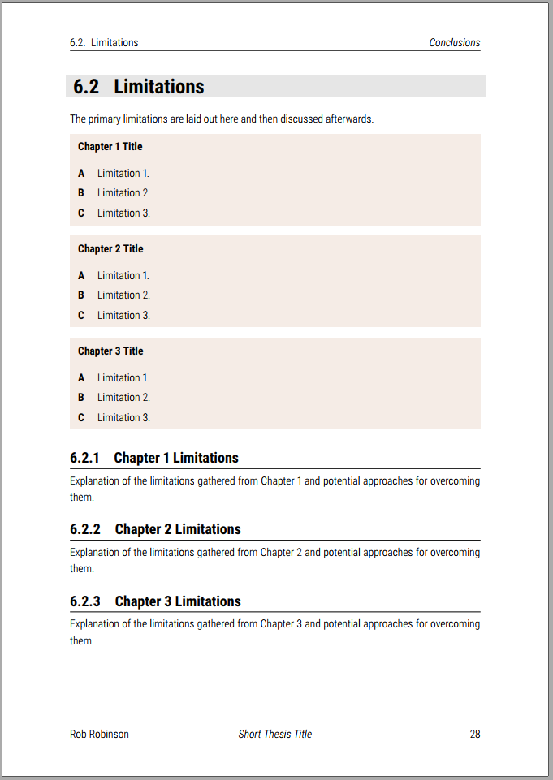
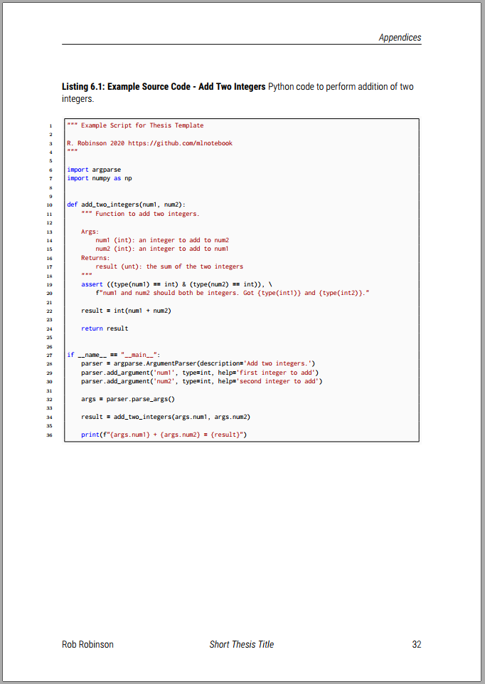

# PhD Thesis Template

This LaTeX template was created by Rob Robinson for his PhD Thesis: final version submitted July 22nd 2020.

[A copy of the finished thesis is available in this repository](https://github.com/mlnotebook/thesis_template/blob/master/Robinson-R-2020-PhD-Thesis.pdf), but will also be available on Imperial College London's Spiral Repository.

If you use this template, please be sure to accreddit the repository in the "Declaration" section of your thesis:

```latex
The formatting for this thesis is taken from the Thesis Template by R. Robinson at \url{https://github.com/mlnotebook/thesis_template}.
```

## Features:

* Figures and Tables are in their own contrasting coloured boxes.
* Captions have a title and description component.
* Chapter headings get their own page with abstract formatting.
* Pre-amble includes epigraph, dedication and other standard sections.
* A 'listings' environment is repurposed to hold Source Code in the Appendix. Also added to Table of Contents.
* Acronyms are shown in the preamble.

## User-defined Commands

Blank page:
* `\newcommand{\blankpage}{\newpage\null\thispagestyle{empty}\newpage}`

Italicized Latin:
* `\newcommand{\eg}{\textit{e.g.}}`
* `\newcommand{\ie}{\textit{i.e.}}`
* `\newcommand{\cf}{\textit{c.f.}}`
* `\newcommand{\etc}{\textit{etc.}}`
* `\newcommand{\etal}{\textit{et al.}}`

Horizontal Rule above Paragraph:
* `\newcommand{\aboveparrule}{\leavevmode\rule{0.9\textwidth}{0.15ex}}`

New page at each Section:
* `\newcommand{\sectionbreak}{\clearpage}`

Caption title and description (title also appears in Table of Contents):
* `\newcommand*\mycaption[2]{\caption[#1]{\textbf{#1} #2}}`

## Preview

<table style="vertical-align: top;">
<tr>
<td>
<b>Chapters</b>

Chapter headings in the template have their own page. They are aligned to the bottom of the page and consist of:
<ul>
<li>Chapter number - automatically enumerated.</li>
<li>Abstract - written in the bespoke 'cabstract' environment.</li>
<li>Description/publication statement - recognition of publication status of the work in the chapter.</li>
</ul>

</td>
<td>

</td>
</tr>
<tr>
<td>
<b>Figures</b>

<ul>
<li>Figures use the 'mdframed' package to give a contrasting background to the figure image.</li>
<li>Captions use the 'mycaption' user-defined command noted above which has a title and description component.</li>
</ul>
</td>
<td>
    
</td>
</tr>
<tr>
<td>
<b>Tables</b>

<ul>
<li>Tables use the 'mdframed' package to give a contrasting background to the table.</li>
<li>The 'colorbox' is used to make sure that the tables have an enclosing white box if multiple tables are stacked together.</li>
<li>Multiple tables can be stacked together horizontally or vertically using the 'minipage' environment.</li>
<li>Captions use the 'mycaption' user-defined command noted above which has a title and description component.</li>
</ul>
</td>
<td>

</td>
</tr>
<tr>
<td>
<b>Shaded Sections</b>

<ul>
<li>The 'shaded' environment is used to create color blocks to emphasis distinct blocks of text - perhaps summaries or definitions.</li>
</ul>
</td>
<td>


</td>
</tr>
<tr>
<td>
<b>Source Code</b>

<ul>
<li>A 'listings' environment has been repurposed to hold source code. These are held in the appendix. The listings are given their own table of contents after the list of tables.</li>
</ul>
</td>
<td>

</td>
</tr>
</table>